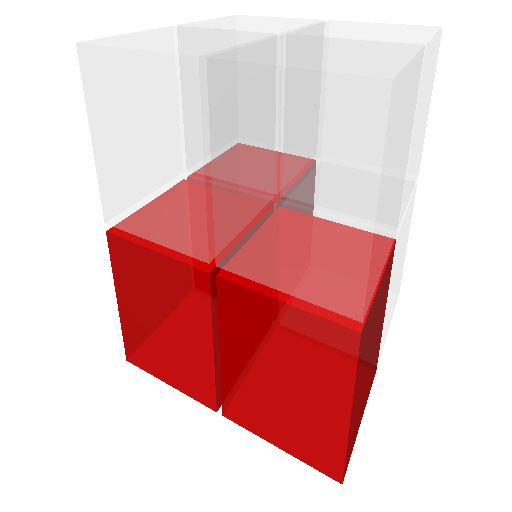
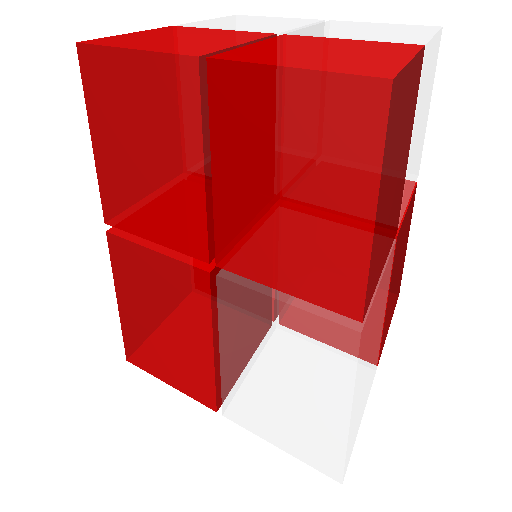

# Cube Vertex Colorings
Simple app for generating and rendering all orbits (i.e. colorings modulo rotations) of cube vertices using
the known 24 octahedron rotational symmetries.

## Installation
POV-Ray must be installed and accessible via `PATH`.

No 3rd party Python dependencies.

Tested on Python 3.11

## Usage
`python app.py number_of_colors`

Between 1 and 4 colors are supported. Can extend that number by adding more colors to `COLOR_MAP` in `rendering.py`.

## Example
All 23 (per Burnside's lemma) distinct 2-color colorings of cube vertices:

<table>
    <tr>
        <td>
            
        </td>
        <td>
            
        </td>
        <td>
            
        </td>
        <td>
            
        </td>
    </tr>
    <tr>
        <td>
            
        </td>
        <td>
            
        </td>
        <td>
            
        </td>
        <td>
            
        </td>
    </tr>
    <tr>
        <td>
            
        </td>
        <td>
            
        </td>
        <td>
            
        </td>
        <td>
            
        </td>
    </tr>
    <tr>
        <td>
            
        </td>
        <td>
            
        </td>
        <td>
            
        </td>
        <td>
            
        </td>
    </tr>
    <tr>
        <td>
            
        </td>
        <td>
            
        </td>
        <td>
            
        </td>
        <td>
            
        </td>
    </tr>
    <tr>
        <td>
            
        </td>
        <td>
            
        </td>
        <td>
            
        </td>
    </tr>
</table>

